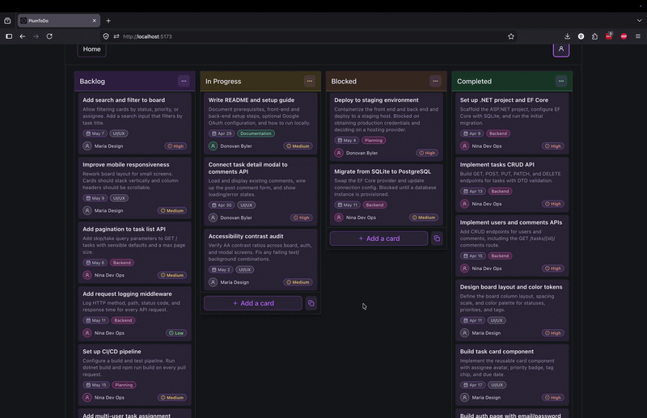

# PlumToDo

PlumToDo is a simple task management app built with a C#/.Net Core back-end and a React/Vite front-end. The app allows users to create tasks, assign them to different columns on a board (e.g. "To Do", "In Progress", "Done"), and view task details. This project was built as a proof of concept to demonstrate my code quality, design skills, and ability to learn new technologies. The app is not production ready and there are many improvements and additional features that could be added in the future, but it serves as a solid foundation to build upon.

## Quick Start

### Helpful Reading

- [C# Getting started guide](https://learn.microsoft.com/en-us/dotnet/csharp/tour-of-csharp/)
- [React Getting started guide](https://react.dev/learn)
- [Vite Getting started guide](https://vitejs.dev/guide/)
- [Drag and Drop Functionality](https://github.com/alexreardon/pragmatic-board)
- [Google OAuth in React](https://developers.google.com/identity/gsi/web/guides/overview)
- [Google OAuth in .Net Core](https://developers.google.com/api-client-library/dotnet/get_started#auth)

## 🔧 Config

The app can be run in two modes:

- Without Google OAuth: simplest local setup and the recommended way to get the app running quickly.
- With Google OAuth: optional, but requires creating a Google Cloud project, configuring OAuth credentials, and wiring both the front end and back end.

Front-end environment variables live in [front-end/example.env](./front-end/example.env). Copy that file to `front-end/.env` for local development.

The back end uses standard ASP.NET configuration. For local development, the safest approach is `dotnet user-secrets` rather than committing secrets to `appsettings.json`.

### Prerequisites

- [.Net Core SDK](https://dotnet.microsoft.com/en-us/download)
- [Node.js](https://nodejs.org/en/download/)

### Setup

1. Clone the repo and navigate to the project directory.

#### Front End

1. In `front-end`, copy `example.env` to `.env`.
2. Set `VITE_API_BASE_URL=http://localhost:5222`.
3. For the easiest local setup, leave `VITE_USE_GOOGLE_AUTH=false`.
4. Run `npm install` in `front-end`.

If you are not using Google OAuth, that is all you need on the front end.

#### Back End

1. In `back-end`, run `dotnet restore`.
2. Start with the default local setup first. Google credentials are not required unless you explicitly want Google sign-in.

#### Optional Google OAuth Setup

Google OAuth is supported, but it is intentionally optional because it adds extra setup overhead.

If you want to enable it:

1. Create a Google Cloud project.
2. Enable the Google Identity / OAuth flow for that project.
3. Create OAuth client credentials.
4. Follow Google's setup guide to configure consent, redirect behavior, and local development settings.
5. In `front-end/.env`, set `VITE_USE_GOOGLE_AUTH=true`.
6. In `front-end/.env`, set `VITE_AUTH_CLIENT_ID` to your Google client ID.
7. In `back-end`, store the matching credentials with user secrets:

```bash
dotnet user-secrets init
dotnet user-secrets set "GoogleAuth:ClientId" "your-google-client-id"
dotnet user-secrets set "GoogleAuth:ClientSecret" "your-google-client-secret"
```

If you do not need Google sign-in, skip all of that and keep `VITE_USE_GOOGLE_AUTH=false`.

### Running the App

#### Back End

1. In `back-end`, run `dotnet run`.
2. The API runs at `http://localhost:5222` by default.

#### Front End

1. In `front-end`, run `npm run dev`.
2. Open `http://localhost:5173`.

If `VITE_USE_GOOGLE_AUTH=false`, the app still runs normally and you can bypass the dummy sign in without completing the Google OAuth setup.

## Design Overview

### 📏 Design Principles

- _Simplicity:_ Focused on core features and avoided over-engineering. Used starter templates and skipped non-essential features like advanced search.
- _Maintainability:_ Kept clear separation of concerns and reusable UI components. Used code-first database design and modular React components.
- _Scalability:_ Used RESTful APIs and layered architecture to support future growth. Services handle business logic, controllers manage requests.
- _Performance:_ Minimized unnecessary re-renders and used efficient drag-and-drop tooling. Leveraged @atlaskit/pragmatic-drag-and-drop library.
- _Intuitive UX:_ Prioritized a fast, clean, and satisfying board interaction model. Focus on smooth drag-and-drop experience for core task workflow.

### 🤔 Design Tradeoffs

- _Time vs. completeness:_ Prioritized a strong core experience over broad feature coverage. Better to ship a polished core than a half-baked feature set.
- _Library vs. custom build:_ Used proven libraries and starter templates to move faster with better UX and more security. Leveraged expertise of maintainers rather than reinventing.
- _Simplicity vs. scale:_ Chose a simple POC data model without normalization. Can refactor to proper schema (BoardAssignments, TaskTags, etc.) as needs evolve.
- _Desktop-first vs. mobile-first:_ Optimized for desktop interactions first, with responsive work planned next. Faster iteration on the core desktop experience.

### Highlights


- Drag-and-drop task board with smooth, intuitive interactions.
- Sign-in page with dummy email/password flow; optional Google OAuth integration for glimpse of what prod would be.

### ⚙️ Back End

The back-end is built with C# and .Net Core. C# and .Net Core allows for high performance, scalability, and strong typing. Below is an overview of the back-end architecture and file structure. This was a new language for me, so I kept the architecture simple and focused on implementing the core features of the app. The back-end is structured around a RESTful API design, with controllers handling HTTP requests and services containing the business logic.

#### Architecture

- `Controllers/` - API controllers that handle incoming HTTP requests and return responses
- `DTOs/` - Data Transfer Objects used for defining the shape of data sent and received by the API
- `Models/` - C# classes that define the data models and database schema
- `Services/` - Classes that contain the business logic and interact with the database
- `Data/` - Contains the database context class that manages the connection to the database and provides access to the data models. Additionally, stores the database seeding file that populates the database with initial data for the POC.
- `Program.cs` - Main entry point of the application where the application is configured and run.
- `appsettings.json` - Configuration file for application settings, including database connection strings and other environment-specific variables.
- `back-end.csproj` - Project file that defines the project dependencies and build configuration.

#### Database Schema

We use EF Core to define a SQL Lite database via [models](./back-end//Models) directly in our code. This allows for strong type checking and version control of our database schema. Below is a high level overview of the tables in our database and their relationships.

- `User`
  - `id` (primary key)
  - `email`
  - `name`
  - `title`
  - `department`
  - `location`
  - `phone`
  - `password`

- `Task`
  - `id` (primary key)
  - `userId` (foreign key to User)
  - `title`
  - `description`
  - `status` (e.g. "To Do", "In Progress", "Done")
  - `dueDate`
  - `priority` (e.g. "Low", "Medium", "High")
  - `tag` (tag name)
  - `tagColor` (color id corresponding to tags)

- `Comment`
  - `id` (primary key)
  - `taskId` (foreign key to Task)
  - `userId` (foreign key to User)
  - `content`

⚠️ Note that the above schema reflects what was needed for this POC. There would be significant revisions needed to make this schema production ready, for example, normalizing tags into a junction table and adding a table for task attachments. See the next steps section below for some ideas on how to expand this schema for a production ready app.

### 🪟 Front-End

Our front-end is built with React and Vite. We use React for its component-based architecture and Vite for its fast development server and optimized build process. Below is an overview of the front-end architecture and file structure.

#### Architecture

- `dist/` - Compiled output of the app after running the build script
- `public/` - Static assets like app icons & favicon
- `src/`
  - `components/` - Reusable UI components (e.g. Button, Modal, TaskCard)
  - `pages/` - Page level components corresponding to routes (e.g. Board, TaskDetail, Profile)
  - `services/` - API service functions for making HTTP requests to the back-end
  - `utils/` - Utility functions and types (e.g. data transformation helpers, type definitions)
  - `hooks/` - Custom React hooks for shared logic (e.g. drag and drop state management)
  - `App.tsx` - Main app component
  - `main.tsx` - Entry point of the application
- `package.json` - Project definition and scripts
- `vite.config.ts` - Vite configuration file
- `tsconfig.json` - TypeScript configuration file

#### Pages/Views

Currently, the app has the following pages/views. This allows for a sense of what the user journey through the app looks like and how the different components fit together, while not over-engineering before getting guidance on the project direction.

- Login Page
- Task Board Page
- Task Creation Page
- Task Detail Page
- Profile Page

## Next Steps

Potential improvements, loosely ordered by impact.

### ✨ Features

- File attachments.
- Multi-user task assignment.
- Task dependencies.
- Subtasks and checklists.
- Board and column customization.
- Multiple boards by project/team.
- Task templates.
- Search and filtering.
- Task activity log.
- Integrations (calendar, Slack, email, internal tools).

### 🏗️ Infrastructure

- Proper authentication and session management (the current non-google sign-in is a POC stub).
- Migrate from SQLite to PostgreSQL or MySQL.
- Normalize task, board, tag, and history schema.
- Improve error handling and logging.
- Add caching and pagination.
- Containerize and deploy.
- Set up CI/CD.
- Add monitoring and alerting.
- Add retries and exponential backoff.

### 💻 UI/UX

- Mobile responsiveness.
- Accessibility improvements.
- Theme customization.
- Improve visual consistency and polish.

## Libraries

### Front-End

- [React](https://react.dev/) - JavaScript library for building user interfaces, used for creating the front-end of the application.
- [Vite](https://vitejs.dev/) - Build tool that provides a fast development server and optimized build process for modern web applications, used to bundle and serve the React app.
- [TypeScript](https://www.typescriptlang.org/) - Superset of JavaScript that adds static typing, used to improve code quality and maintainability in the front-end.
- [@atlaskit/pragmatic-drag-and-drop](https://www.npmjs.com/package/@atlaskit/pragmatic-drag-and-drop) - Library used to implement drag and drop functionality on the task board.
- [tiny-invariant](https://www.npmjs.com/package/tiny-invariant) - Used for checking assertions to throw errors when certain conditions are not met within the drag and drop functionality.

### Back-End

- [Microsoft.EntityFrameworkCore](https://www.nuget.org/packages/Microsoft.EntityFrameworkCore/) - Object-relational mapper (ORM) for .NET used to interact with the database using C# objects.
- [Microsoft.EntityFrameworkCore.Sqlite](https://www.nuget.org/packages/Microsoft.EntityFrameworkCore.Sqlite/) - SQLite provider for Entity Framework Core, allowing us to use a SQLite database for this POC.
- [Microsoft.EntityFrameworkCore.Design](https://www.nuget.org/packages/Microsoft.EntityFrameworkCore.Design/) - Design-time tools for Entity Framework Core, used for development purposes such as migrations and scaffolding.
- [Microsoft.AspNetCore.OpenApi](https://www.nuget.org/packages/Microsoft.AspNetCore.OpenApi/) - Provides OpenAPI (Swagger) support for ASP.NET Core applications, allowing for automatic generation of API documentation and testing UI.
- [Google.Apis.Auth](https://www.nuget.org/packages/Google.Apis.Auth/) - Library for handling Google authentication, used to implement Google OAuth for user authentication in the app.

## Contributors

[Donovan Byler](https://github.com/Dbyler8)
